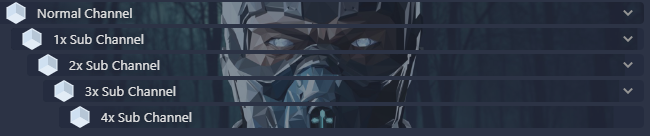

# TS5-Channel-Image-Generator

# what does this script do?
You can upload a picture (ONLY png), the script will create the appropriate snippets for your Teamspeak channels and if you click on them you get the url.
_______________________________________________________________________________

This Script ONLY work for the New Teamspeak Client.

Open the checkmodul.php and look if you have the requirements for this script.
_______________________________________________________________________________

[DEMO](https://ts5x.cf) 

# Docker Image
[Docker](https://hub.docker.com/r/virose/teamspeak-channel_img_generator)
